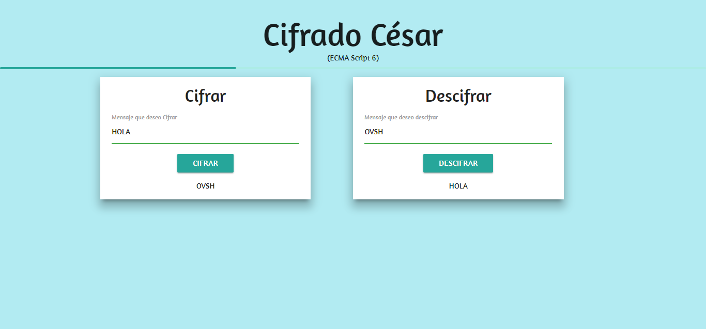

# **CIFRADO CESAR**

* Track: Common Core
* Curso: JS Deep Dive: Crea tu propia librería usando JavaScript
Unidad: Ejercicio
* Framework: materialize
* ECMAscript 6

## Introducción
El siguiente programa te ayuda a cifra un mensaje para que con otros que conoscan de el programan puedan entender tu mensaje cifrado por medio del descifrado que te permite descifrar el mensaje.

E- mail : <jessica95.mp@gmail.com>
